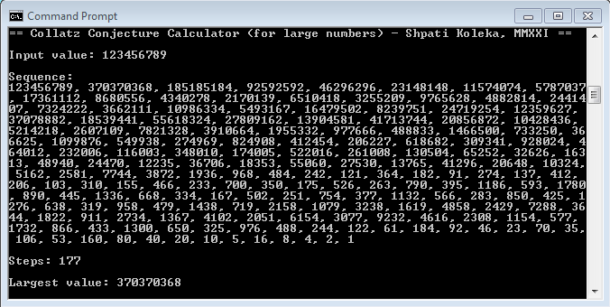

# Collatz Conjecture Calculator

The Collatz Conjecture Calculator is a small (4kb) but powerful program for calculating the collatz sequences of very large numbers.
How large? Over 8000 digits! Try it out.

Some of the program features are:
- Displays the collatz sequence of values
- Displays the number of steps until the value of 1 is reached
- Displays the largest value of the sequence

- You can also enter the input value to be calculated as a command line argument when calling the program:

`collatz 123456789012345678901234567890`

 - Optionally you can save the full output to a file:

`collatz 123456789012345678901234567890 > output.txt` 

- It is possible to hide the sequence to speed up the operations. This can be done by adding any string or character right after the input value in the command line:
  
`collatz 123456789012345678901234567890 -`

- It is possible to hide the sequence of the operations as well as explanatory text of the output. This can be done by adding any two strings or characters right after the input value in the command line:
  
`collatz 123456789012345678901234567890 - -`

 The output in the latter case will just be the input value, number of steps and the largest value in the sequence.

- Optionally you can save this form of barebones output to a file:

`collatz 123456789012345678901234567890 - - > output.txt`

Collatz 1.0.1 (c) Copyright Shpati Koleka MMXXI - MIT License